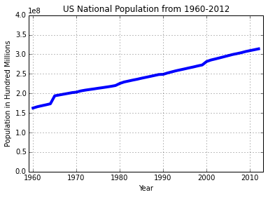
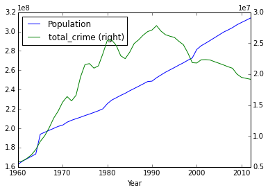
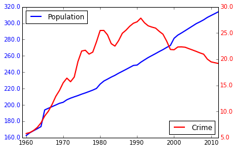
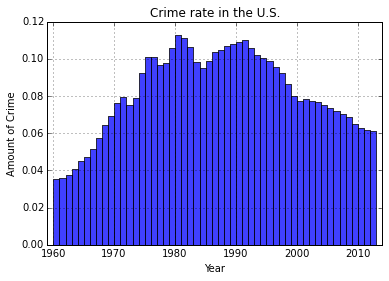
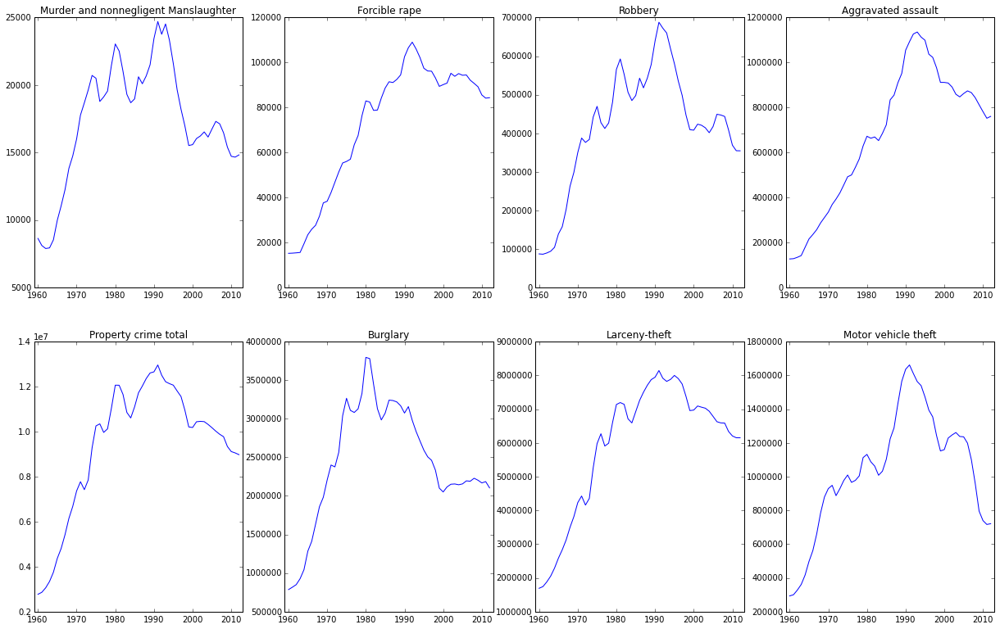
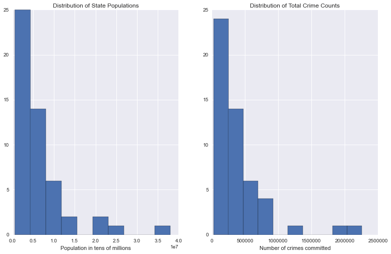
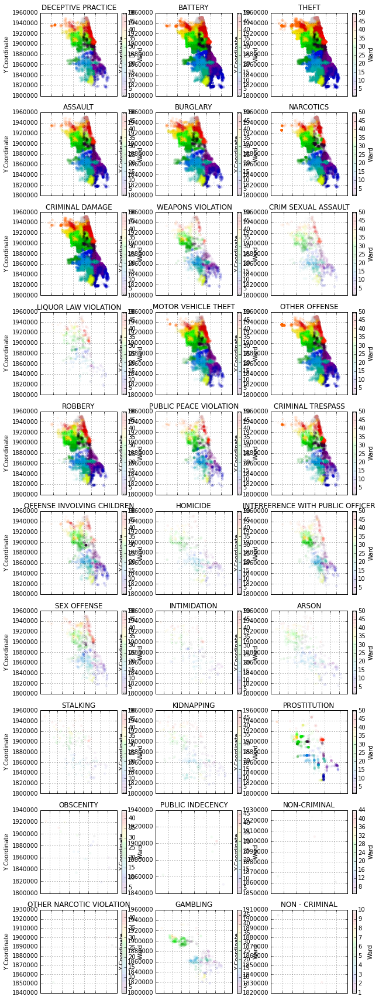

# Assignent Part 1:  Becoming friendly with matplotlib.pyplot as plt
The first part of of todays assignments is aimed to get your comfortable with using the somewhat wonky matplolib functions and methods.  

### Chart 1: Plotting the monthly trend of arrests.

* Load the `chitown_crime_arrests_vs_reports.csv` into a pandas DataFrame
* Take the 'Arrests', and 'MonthStr' columns out by using the `df['column name '].values` function
* Create a barplot with the height of the bar is the number of arrests for each month
* Now customize your x-ticks to be the month names, and not just intergers
* Make the plot bigger, make it something like 13 x 8 (or any fibonacci ratio)
* Make the Y-axis height to range from 0 to 10000 instead of 9000
* Align the xticks to be in the center of each bar
* If that alignment make your graph look a bit wonky, try adjusting the xlim to fix it

When you are done Chart 1 should look something like this.  

---
<br>
<br>

### Chart 2:  Plotting population over time.  
This is something just to get you warmed up, it can be done with one line of code.  Use the `50year-national-crime-population-totals.csv` data file, and plot a line chart where the x-axis is the year, and the y-axis is the national population.  
 * Make sure to give your chart a title, and label the x/y axes.
 * Change the y-axis to start at 0, instead of the population min.
 * Also change the x-axis in a way that doesn't look confusing to you.
 * Tweak the chart as you see fit, just thinkg 'What would Tufte do...'
Once done with creating that line chart, do it again, but as a bar chart.

---

### Chart 3: Plotting total crime and population.

Now, plot both the population and total crime from 1960 to 2012 on one chart, with two different y-axis.  There is many ways to do this, I recommend using pandas plotting, with a `secondary_y='your other y'` as an argument in the `df.plot()` function.


However, if you would like to have more control over your plotting, you can create a matplotlib subplot with a twin-x-axis.

* *This is optional, if you get stuck after 20min keep going. *
* Create just one subplot `fig, ax = plt.subplots()
`
* Duplicate the subplot ax x-axis by using `ax2 = ax.twinx()`
* Use treat `ax, and ax2` as you would you `plt`.
* So... `ax.plot( Population data goes here )`
* To customize the way your y-ticks look, first we need to get the tick label information by using `tick_locs = ax.get_yticks()`.  This returns a list of the locations of the ticks that will be plotted.
* Instead of y-ticks being a very hard to read long number, or an annoying scientific notation which only scientists understand, reformat the returned list to be in hundreds of millions ` tick_text = [ x / 1000000.0 for x in tick_locs ]`
* Set our new formatted tick labels as the y-tick lables via `ax.set_yticklabels(tick_text, color='b')`
* Set the location of the legend so the next one doesn't fall ontop of it
`ax.legend(loc='upper left')`

* Now do everything the same for the total_crime column.  This time on `ax2`.

This is what it can look like.


---
<br>
<br>

### Chart 4: Which year had the highest rate of crime...
Using what you have practiced so far, create a bar chart of the RATE of crime in the US from 1960 to now. Your chart could look something like this.  

---
<br>
<br>


### Chart 5: Plot all the trends of crimes using subplots.
* Create a subplot with 2 rows and 4 columns
* Create a list of the columns you want to plot. Here are the columns: `[ u'Murder and nonnegligent Manslaughter', u'Forcible rape', u'Robbery', u'Aggravated assault', u'Property crime total', u'Burglary', u'Larceny-theft', u'Motor vehicle theft']`
* Use a double for loop and a counter to loop through the number of rows, then number of cols, then plot the correspond column in your data frame. **See the lecture.md file for an example of how this works.**

Your final figure should look something like this.

---
<br>

### Chart 6: Distributions of populations and total crimes
Plot a histogram of the distribution of population, and plot a histogram of the distribution of total crime, do not have them overlay.


* Load in the `total-crime-and-population.csv` into a pandas df.
* Use the `fig, (plt1, plt2) = plt.subplots(ncols=2)` to setup two plots.
* Use `plt1.hist()` to your first histogram.
* Set the title that makes sense for that histogram.
* Name your x-axis that makes sense to the reader.
* Then... do it again for your second histogram.  


---
<br>
<br>

### Scatter plot of crime locations.
* Load the `chitown_crime_only_2013.csv` into a pandas dataframe.
* Create one subplot for each type of crime (Primary Type col). *There is like 1,000 ways to do this. I like setting the index to the Primary Type*
* Use the X and Y coordinate columns as the X and Y coordinates for your scatterplot.
* Try setting the alpha very very low.  
* If you get fancy, your graph can look like this...
* 

<br>
<br>
### Extra Credit: Heatmap of Arson.  
*[~30-60 min]*
Step 0:  Load in seaborn as sns
Step 1:  Load the `chitown_crime_monthly.csv` data into pandas
Step 2:  Convert the Date column to a datetime object
Step 3:  Set the Date column to the index  
Step 4:  Keep only data in the Primary Type column that is ARSON.
Step 5:  Make a pivot table so the rows are the years, and the columns are the months, and the cell values are the how many arson fires there were that month.
Step 6:  Use the `sns.heatmap()` function to plot the heat map.
Step 7:  Fix the yticks so they are no longer rotated -90 deg.
Step 8:  Change the color to one that would best convey your message and subject.


---
<br>
<br>
# Extra Credit 2: Coloring coding crime with Plot.ly

In the previous part we have looked at crimes over a number of years, here we
will focus on a month's worth of crimes. We will visualize the location of the
crimes as points and color code the type of crime. This will allow us to examine
the distribution of different crimes geographically.

**If you want to check out the results you are going to produce,
see [this](https://plot.ly/~jyt109/87/)**

**If you are stuck at any point of this exercise
[this link](https://plot.ly/python/bubble-charts-tutorial/) will help**

- For this exercise, you will need the plotly library. Do the following imports

```python
import plotly.plotly as py
import plotly.tools as tls
from plotly.graph_objs import *
```

- Read ``data/dec_crime_loc.csv`` into a pandas dataframe. This csv only
contains crimes in the month of **Dec, 2014**

- Group by the column ``Primary Type`` in pandas and assign to variable
``dec_grp_by_crime``. This will give us dataframes partitioned by the type
of the crime in a pandas group-by object

- Count the rows in each group in ``dec_grp_by_crime`` and select the top five
``Primary Type``. Assign to variable ``select_gps``. These are the types of
crimes that we will visualize. Visualizeing all the types of crimes will
overcrowd the graph and affect interpretation.

- Define a ``make_text()`` function which display the text you want to see
when your mouse hover over a crime data point. The function will take a series
(a row in the dataframe) as an argument, and return a formatted string using
the information in the series, ie ``row['Description']``, ``row['location']``
and ``row['Primary Type']``. Modify the code below from another example to
build your function

```python
def make_text(X):
    return 'Country: %s\
    <br>Life Expectancy: %s years\
    <br>GDP per capita: %s $\
    <br>Population: %s million'\
    % (X['country'], X['lifeExp'], X['gdpPercap'], X['pop']/1e6)
```


- Define a ``make_trace()`` function which will plot the ``Longitude`` and
``Latitude `` of the crimes given a particular type of crime.
The function takes 3 arguments: **a dataframe of a given type of crime**,
**the type of crime** and **the color for the particular type of crime**.
The function will return a ``Scatter()`` object which specifies what is to be
plotted and the appearance of the scatter points. Modify the code below from
another example to build your function.

```python
def make_trace(X, continent, sizes, color):
    return Scatter(
        x=X['gdpPercap'],  # GDP on the x-xaxis
        y=X['lifeExp'],    # life Exp on th y-axis
        name=continent,    # label continent names on hover
        mode='markers',    # (!) point markers only on this plot
        marker= Marker(
            color=color,           # marker color
            size=sizes,            # (!) marker sizes (sizes is a list)
            sizeref=sizeref,       # link sizeref
            sizemode=sizemode,     # link sizemode
            opacity=0.6,           # (!) partly transparent markers
            line= Line(width=0.0)  # remove marker borders
        )
    )
```

- Define a dictionary where the keys are the types of crimes, and the values are
the colors we want to display the crimes in (in rgb). The code is a bit tricky,
so in the interest of time, I have provided the code for you.
``crime_name2color`` is the dictionary. Essentially we grab the ``Accent``
color scheme from matplotlib's built-in colormap (``cm``) and evenly select 5
points in the color scheme, and map them to different crime types

```python
#import matplotlib.pyplot as plt
#import numpy as np
n = len(select_gps) # select_gps are defined above
colors = plt.cm.Accent(np.linspace(0, 1, n))
rgb = ['rgb(%s)' % ','.join(map(str, color[:-1])) for color in colors]
crime_name2color = dict(zip(select_gps, rgb))
```
- Define ``data = Data()``. ``data`` is a list and you will append ``Scatter()``
objects (from ``make_trace()``) to ``data``.
Loop through the 5 most popular crimes in ``select_gps``. For each type, extract
the dataframe associated to that type of crime using ``get_group()`` in pandas.
In the loop, feed the relevant parameters to the ``make_trace()`` function
defined above. Append the returned object from ``make_trace()`` to ``data``

- Include the code below to specify the layout of the graph

```
layout = Layout(
    hovermode='closest',
    width=1000,
    height=1000)
```

- Run the following code to get the plot. The graph should pop up in a
separate tab in the browser

```
fig = Figure(data=data, layout=layout)
py.plot(fig)
py.iplot(fig) # Plot in the ipython notebook
```
- Answer the following the questions by visually analyzing the graph:
    - The intersection of which 3 districts have the highest density of NACROTICS
    crime?
    - The intersection of which 2 districts have the highest density of THEFT?

- Feel free to add extra observations. Try plotting different combinations
of the types of crime to find interesting pattern of geographic distribution
of different types of crimes
