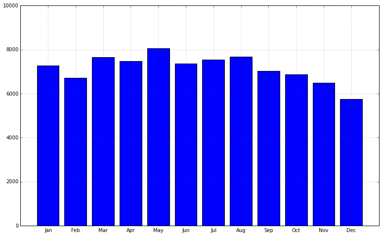
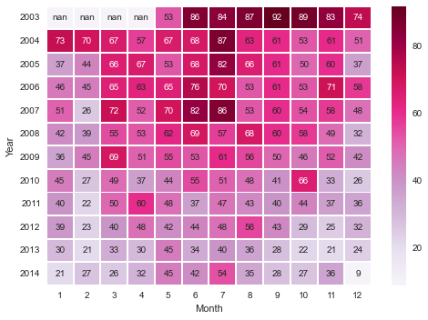

# Assignent Part 1:  Becoming friendly with matplotlib.pyplot as plt
The first part of of todays assignments is aimed to get your comfortable with using the somewhat wonky matplolib functions and methods.  

### Chart 1:
Plotting the monthly trend of arrests.

* Load the `chitown_crime_arrests_vs_reports.csv` into a pandas DataFrame
* Take the 'Arrests', and 'MonthStr' columns out by using the `df['col'].values` function
* Create a barplot with the height of the bar is the number of arrests for each month
* Now customize your x-ticks to be the month names, and not just intergers
* Make the plot bigger, make it something like 13 x 8 (or any fibonacci ratio)
* Make the Y-axis height to range from 0 to 10000 instead of 9000
* Align the xticks to be in the center of each bar
* If that alignment make your graph look a bit wonky, try adjusting the xlim to fix it

When you are done Chart 1 should look something like this.  



<br>
<br>
<br>

# Assignent Part 2:  Data Detective
*Part one assignment should take you from 2-3 hours.*

Today you will be investigating a decade of crime that took place in Chicago from 2002-2013.  http://www.pbs.org/wgbh/pages/frontline/interrupters/#the-interrupters-(graphic-language)
### Chart 1:  Is crime rising or falling in Chicago?
Visually show me if the crime rates are rising or falling each year. *[~30min]*

Step 1:  Load the `chitown_crime_yearly.csv` data into pandas  
Step 2:  Convert the Date column to a datetime object  
Step 3:  Set the Date column to the index  
Step 4:  Use pandas `resample('A', how='<think about it>')` function to aggregate by year  
Step 5:  Plot/visualize the trend of the data the best way you see fit.   Be prepared to explain which visualization technique you chose and why.

<br>

### Chart 2: Tis the season for crimes.

Use the `chitown_crime_monthly.csv`, and create a plot that will let us see if there is any seasonal affect on crime. *[~45min]*

Step 1:  Load the `chitown_crime_monthly.csv` data into pandas
Step 2:  Convert the Date column to a datetime object
Step 3:  Set the Date column to the index  
STEP 4: Make a column that is just the year interger [2002, ..., 2013] YYYY
STEP 5: Make a column that is just the number of the month [1, ..., 12]
STEP 6: Make a column that is just the name of the month [Jan, Feb...] *Step 6 is not imperative and somewhat tricky.  If you dont get it in 10min just move on.*
STEP 7: Groupby that month column you made, and sum the counts.
STEP 8:  Show me if ther is any seasonality in the crime in Chitown...

<br>
### Extra Credit: Heatmap of fires.
*[~30-60 min]*
Step 0:  Load in seaborn as sns
Step 1:  Load the `chitown_crime_monthly.csv` data into pandas
Step 2:  Convert the Date column to a datetime object
Step 3:  Set the Date column to the index  
Step 4: Keep only data in the Primary Type column that is ARSON.
Step 5: Make a pivot table so the rows are the years, and the columns are the months, and the cell values are the how many arson fires there were that month.
Step 6:  Use the `sns.heatmap()` function to plot the heat map.
Step 7:  Fix the yticks so they are no longer rotated -90 deg.
Step 8:  Change the color to one that would best convey your message and subject.



<br>
<br>
<br>

#Part 3: Coloring coding crime

In the previous part we have looked at crimes over a number of years, here we
will focus on a month's worth of crimes. We will visualize the location of the
crimes as points and color code the type of crime. This will allow us to examine
the distribution of different crimes geographically.

**If you want to check out the results you are going to produce,
see [this](https://plot.ly/~jyt109/87/)**

**If you are stuck at any point of this exercise
[this link](https://plot.ly/python/bubble-charts-tutorial/) will help**

- For this exercise, you will need the plotly library. Do the following imports

```python
import plotly.plotly as py
import plotly.tools as tls
from plotly.graph_objs import *
```

- Read ``data/dec_crime_loc.csv`` into a pandas dataframe. This csv only
contains crimes in the month of **Dec, 2014**

- Group by the column ``Primary Type`` in pandas and assign to variable
``dec_grp_by_crime``. This will give us dataframes partitioned by the type
of the crime in a pandas group-by object

- Count the rows in each group in ``dec_grp_by_crime`` and select the top five
``Primary Type``. Assign to variable ``select_gps``. These are the types of
crimes that we will visualize. Visualizeing all the types of crimes will
overcrowd the graph and affect interpretation.

- Define a ``make_text()`` function which display the text you want to see
when your mouse hover over a crime data point. The function will take a series
(a row in the dataframe) as an argument, and return a formatted string using
the information in the series, ie ``row['Description']``, ``row['location']``
and ``row['Primary Type']``. Modify the code below from another example to
build your function

```python
def make_text(X):
    return 'Country: %s\
    <br>Life Expectancy: %s years\
    <br>GDP per capita: %s $\
    <br>Population: %s million'\
    % (X['country'], X['lifeExp'], X['gdpPercap'], X['pop']/1e6)
```


- Define a ``make_trace()`` function which will plot the ``Longitude`` and
``Latitude `` of the crimes given a particular type of crime.
The function takes 3 arguments: **a dataframe of a given type of crime**,
**the type of crime** and **the color for the particular type of crime**.
The function will return a ``Scatter()`` object which specifies what is to be
plotted and the appearance of the scatter points. Modify the code below from
another example to build your function.

```python
def make_trace(X, continent, sizes, color):
    return Scatter(
        x=X['gdpPercap'],  # GDP on the x-xaxis
        y=X['lifeExp'],    # life Exp on th y-axis
        name=continent,    # label continent names on hover
        mode='markers',    # (!) point markers only on this plot
        marker= Marker(
            color=color,           # marker color
            size=sizes,            # (!) marker sizes (sizes is a list)
            sizeref=sizeref,       # link sizeref
            sizemode=sizemode,     # link sizemode
            opacity=0.6,           # (!) partly transparent markers
            line= Line(width=0.0)  # remove marker borders
        )
    )
```

- Define a dictionary where the keys are the types of crimes, and the values are
the colors we want to display the crimes in (in rgb). The code is a bit tricky,
so in the interest of time, I have provided the code for you.
``crime_name2color`` is the dictionary. Essentially we grab the ``Accent``
color scheme from matplotlib's built-in colormap (``cm``) and evenly select 5
points in the color scheme, and map them to different crime types

```python
#import matplotlib.pyplot as plt
#import numpy as np
n = len(select_gps) # select_gps are defined above
colors = plt.cm.Accent(np.linspace(0, 1, n))
rgb = ['rgb(%s)' % ','.join(map(str, color[:-1])) for color in colors]
crime_name2color = dict(zip(select_gps, rgb))
```
- Define ``data = Data()``. ``data`` is a list and you will append ``Scatter()``
objects (from ``make_trace()``) to ``data``.
Loop through the 5 most popular crimes in ``select_gps``. For each type, extract
the dataframe associated to that type of crime using ``get_group()`` in pandas.
In the loop, feed the relevant parameters to the ``make_trace()`` function
defined above. Append the returned object from ``make_trace()`` to ``data``

- Include the code below to specify the layout of the graph

```
layout = Layout(
    hovermode='closest',
    width=1000,
    height=1000)
```

- Run the following code to get the plot. The graph should pop up in a
separate tab in the browser

```
fig = Figure(data=data, layout=layout)
py.plot(fig)
py.iplot(fig) # Plot in the ipython notebook
```
- Answer the following the questions by visually analyzing the graph:
    - The intersection of which 3 districts have the highest density of NACROTICS
    crime?
    - The intersection of which 2 districts have the highest density of THEFT?

- Feel free to add extra observations. Try plotting different combinations
of the types of crime to find interesting pattern of geographic distribution
of different types of crimes
