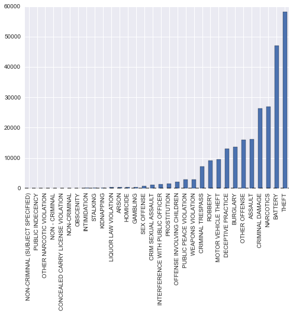
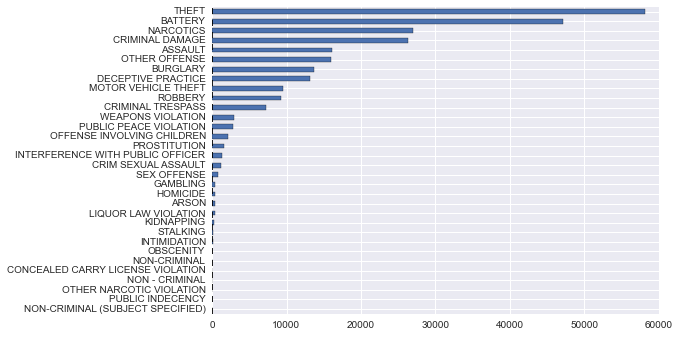

```python
import seaborn as sns
import pandas as pd

# Read in data
df = pd.read_csv('data/chitown_crime_only_2014.csv')

# Inspect your data
df.head()

```


<div style="max-height:1000px;max-width:1500px;overflow:auto;">
<table border="1" class="dataframe">
  <thead>
    <tr style="text-align: right;">
      <th></th>
      <th>Date</th>
      <th>ID</th>
      <th>Case Number</th>
      <th>Block</th>
      <th>IUCR</th>
      <th>Primary Type</th>
      <th>Description</th>
      <th>Location Description</th>
      <th>Arrest</th>
      <th>Domestic</th>
      <th>...</th>
      <th>Ward</th>
      <th>Community Area</th>
      <th>FBI Code</th>
      <th>X Coordinate</th>
      <th>Y Coordinate</th>
      <th>Year</th>
      <th>Updated On</th>
      <th>Latitude</th>
      <th>Longitude</th>
      <th>Location</th>
    </tr>
  </thead>
  <tbody>
    <tr>
      <th>0</th>
      <td> 2014-12-12 23:55:00</td>
      <td> 9890194</td>
      <td> HX540216</td>
      <td>    019XX W HOWARD ST</td>
      <td> 0460</td>
      <td>      BATTERY</td>
      <td>                SIMPLE</td>
      <td>                  BAR OR TAVERN</td>
      <td> False</td>
      <td> False</td>
      <td>...</td>
      <td> 49</td>
      <td>  1</td>
      <td> 08B</td>
      <td> 1161851</td>
      <td> 1950312</td>
      <td> 2014</td>
      <td> 12/19/2014 12:50:35 PM</td>
      <td> 42.019330</td>
      <td>-87.679742</td>
      <td> (42.019330008, -87.679742316)</td>
    </tr>
    <tr>
      <th>1</th>
      <td> 2014-12-12 23:55:00</td>
      <td> 9890218</td>
      <td> HX540250</td>
      <td>    031XX W CERMAK RD</td>
      <td> 0610</td>
      <td>     BURGLARY</td>
      <td>        FORCIBLE ENTRY</td>
      <td> PARKING LOT/GARAGE(NON.RESID.)</td>
      <td> False</td>
      <td> False</td>
      <td>...</td>
      <td> 24</td>
      <td> 30</td>
      <td>  05</td>
      <td> 1155642</td>
      <td> 1889246</td>
      <td> 2014</td>
      <td> 12/19/2014 12:50:35 PM</td>
      <td> 41.851888</td>
      <td>-87.704240</td>
      <td> (41.851888275, -87.704239726)</td>
    </tr>
    <tr>
      <th>2</th>
      <td> 2014-12-12 23:54:00</td>
      <td> 9890183</td>
      <td> HX540236</td>
      <td>   045XX W MADISON ST</td>
      <td> 1506</td>
      <td> PROSTITUTION</td>
      <td> SOLICIT ON PUBLIC WAY</td>
      <td>                       SIDEWALK</td>
      <td>  True</td>
      <td> False</td>
      <td>...</td>
      <td> 28</td>
      <td> 26</td>
      <td>  16</td>
      <td> 1146068</td>
      <td> 1899669</td>
      <td> 2014</td>
      <td> 12/19/2014 12:50:35 PM</td>
      <td> 41.880677</td>
      <td>-87.739114</td>
      <td> (41.880677383, -87.739114376)</td>
    </tr>
    <tr>
      <th>3</th>
      <td> 2014-12-12 23:53:00</td>
      <td> 9890168</td>
      <td> HX540210</td>
      <td>     0000X E 120TH ST</td>
      <td> 2017</td>
      <td>    NARCOTICS</td>
      <td>    MANU/DELIVER:CRACK</td>
      <td>                         STREET</td>
      <td>  True</td>
      <td> False</td>
      <td>...</td>
      <td>  9</td>
      <td> 53</td>
      <td>  18</td>
      <td> 1178695</td>
      <td> 1825448</td>
      <td> 2014</td>
      <td> 12/19/2014 12:50:35 PM</td>
      <td> 41.676325</td>
      <td>-87.621567</td>
      <td> (41.676325013, -87.621567272)</td>
    </tr>
    <tr>
      <th>4</th>
      <td> 2014-12-12 23:52:00</td>
      <td> 9890166</td>
      <td> HX540186</td>
      <td> 0000X N LECLAIRE AVE</td>
      <td> 2017</td>
      <td>    NARCOTICS</td>
      <td>    MANU/DELIVER:CRACK</td>
      <td>                         STREET</td>
      <td>  True</td>
      <td> False</td>
      <td>...</td>
      <td> 28</td>
      <td> 25</td>
      <td>  18</td>
      <td> 1142429</td>
      <td> 1899594</td>
      <td> 2014</td>
      <td> 12/19/2014 12:50:35 PM</td>
      <td> 41.880540</td>
      <td>-87.752479</td>
      <td>   (41.880539936, -87.7524785)</td>
    </tr>
  </tbody>
</table>
<p>5 rows × 22 columns</p>
</div>


```python

# Check the bottom entries, make sure its just 2014
df.tail(3)
```


<div style="max-height:1000px;max-width:1500px;overflow:auto;">
<table border="1" class="dataframe">
  <thead>
    <tr style="text-align: right;">
      <th></th>
      <th>Date</th>
      <th>ID</th>
      <th>Case Number</th>
      <th>Block</th>
      <th>IUCR</th>
      <th>Primary Type</th>
      <th>Description</th>
      <th>Location Description</th>
      <th>Arrest</th>
      <th>Domestic</th>
      <th>...</th>
      <th>Ward</th>
      <th>Community Area</th>
      <th>FBI Code</th>
      <th>X Coordinate</th>
      <th>Y Coordinate</th>
      <th>Year</th>
      <th>Updated On</th>
      <th>Latitude</th>
      <th>Longitude</th>
      <th>Location</th>
    </tr>
  </thead>
  <tbody>
    <tr>
      <th>258157</th>
      <td> 2014-01-01 00:00:00</td>
      <td> 9593821</td>
      <td> HX243996</td>
      <td> 026XX N HAMLIN AVE</td>
      <td> 0266</td>
      <td>        CRIM SEXUAL ASSAULT</td>
      <td>                      PREDATORY</td>
      <td> RESIDENCE</td>
      <td> False</td>
      <td>  True</td>
      <td>...</td>
      <td> 35</td>
      <td> 22</td>
      <td> 02</td>
      <td> 1150643</td>
      <td> 1917217</td>
      <td> 2014</td>
      <td> 05/04/2014 12:39:40 AM</td>
      <td> 41.928743</td>
      <td>-87.721856</td>
      <td> (41.928742654, -87.721855919)</td>
    </tr>
    <tr>
      <th>258158</th>
      <td> 2014-01-01 00:00:00</td>
      <td> 9559785</td>
      <td> HX210852</td>
      <td>    006XX E 89TH PL</td>
      <td> 1754</td>
      <td> OFFENSE INVOLVING CHILDREN</td>
      <td> AGG SEX ASSLT OF CHILD FAM MBR</td>
      <td> RESIDENCE</td>
      <td> False</td>
      <td>  True</td>
      <td>...</td>
      <td>  6</td>
      <td> 44</td>
      <td> 02</td>
      <td> 1182182</td>
      <td> 1845738</td>
      <td> 2014</td>
      <td> 04/18/2014 12:39:21 AM</td>
      <td> 41.731924</td>
      <td>-87.608179</td>
      <td> (41.731923661, -87.608178725)</td>
    </tr>
    <tr>
      <th>258159</th>
      <td> 2014-01-01 00:00:00</td>
      <td> 9598770</td>
      <td> HX249314</td>
      <td>    014XX W 78TH ST</td>
      <td> 1562</td>
      <td>                SEX OFFENSE</td>
      <td>      AGG CRIMINAL SEXUAL ABUSE</td>
      <td> RESIDENCE</td>
      <td> False</td>
      <td> False</td>
      <td>...</td>
      <td> 17</td>
      <td> 71</td>
      <td> 17</td>
      <td> 1167738</td>
      <td> 1852975</td>
      <td> 2014</td>
      <td> 05/07/2014 12:40:24 AM</td>
      <td> 41.752105</td>
      <td>-87.660886</td>
      <td> (41.752104777, -87.660885741)</td>
    </tr>
  </tbody>
</table>
<p>3 rows × 22 columns</p>
</div>


```python
# Now I am just interested in overall, what is the most common type of crime
df['Primary Type'].value_counts()
```


    THEFT                                58131
    BATTERY                              47129
    NARCOTICS                            26981
    CRIMINAL DAMAGE                      26342
    ASSAULT                              16143
    OTHER OFFENSE                        15903
    BURGLARY                             13686
    DECEPTIVE PRACTICE                   13081
    MOTOR VEHICLE THEFT                   9517
    ROBBERY                               9208
    CRIMINAL TRESPASS                     7223
    WEAPONS VIOLATION                     2955
    PUBLIC PEACE VIOLATION                2805
    OFFENSE INVOLVING CHILDREN            2119
    PROSTITUTION                          1550
    INTERFERENCE WITH PUBLIC OFFICER      1358
    CRIM SEXUAL ASSAULT                   1131
    SEX OFFENSE                            818
    GAMBLING                               389
    HOMICIDE                               386
    ARSON                                  382
    LIQUOR LAW VIOLATION                   382
    KIDNAPPING                             217
    STALKING                               129
    INTIMIDATION                           108
    OBSCENITY                               26
    NON-CRIMINAL                            17
    CONCEALED CARRY LICENSE VIOLATION       14
    NON - CRIMINAL                          10
    OTHER NARCOTIC VIOLATION                10
    PUBLIC INDECENCY                         9
    NON-CRIMINAL (SUBJECT SPECIFIED)         1
    dtype: int64


```python
# Lets plot this, this seems like the a job for a barchart or piegraph
bar_data = df['Primary Type'].value_counts()
print type(bar_data.values)
print type(bar_data)
```

    <type 'numpy.ndarray'>
    <class 'pandas.core.series.Series'>


```python
bar_data.plot(kind='bar');
```





```python
# Okay, that is kind of annoying and way to hard to read.
# Lets try and make it easier on the viewer and plot the text the way it reads
bar_data.plot(kind='barh');
```





```python
# The important stuff should go at the top because it is the first place the eye gess
bar_data = bar_data.order()
bar_data.plot(kind='barh');
```


