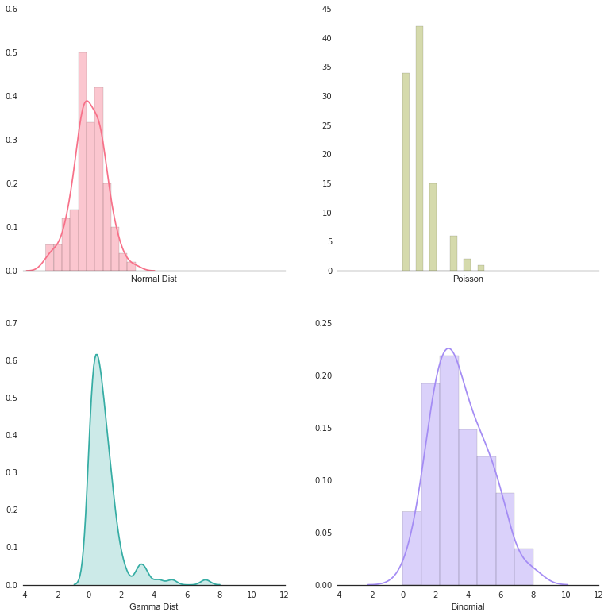
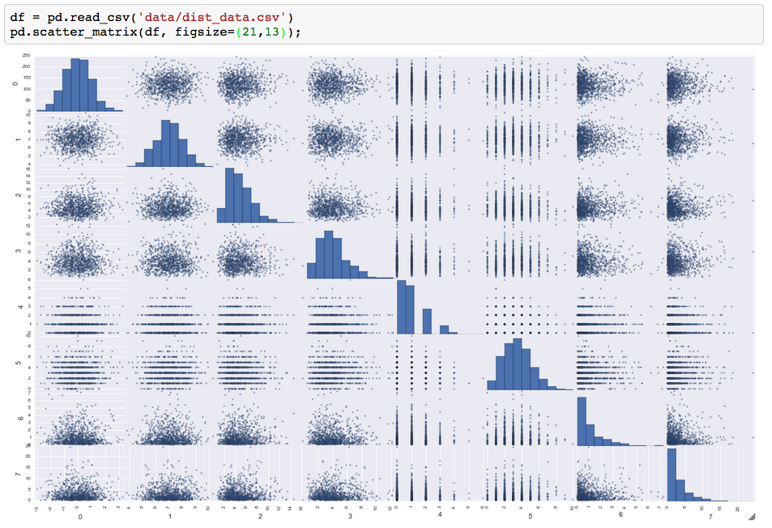

# Introduction to data visualization lecture.  

### Hello Matplotlib.pyplot
As python people, we will be leveraging the plotting library matplotli`b.  It is tricky, but once you get the hang of it, it's as easy as pie.  

Here is a list of the main plots we will be using in the course and how to use them.  
#### Line Plot

```python
import matplotlib.pyplot as plt
ydata = [10,20,30,99]
plt.plot(ydata);
plt.show();
```


---
<br>
#### Bar Plot
```python
plt.bar(left, height, width=0.8, bottom=None, hold=None, **kwargs)

```
```python
# The first argument "left" needs to be a list of the X positions for each bar.  
bars = [10,20,30,99]
xpos = range(len(bars)) #[0,1,2,3]
plt.bar(left=xpos, height=bars)
plt.show()
```

---
<br>
#### Scatter Plot
```python
plt.scatter(x, y, s=20, c='b', marker='o', cmap=None, norm=None, vmin=None, vmax=None, alpha=None, linewidths=None, verts=None, hold=None, **kwargs)
```
```python
x_data = [92, 22, 421, 22]
y_data = [11, 22, 33, 99]
marker_size= [100, 200, 300, 400] #this can be just one value or a list of values the same size of your data
plt.scatter(x=x_data, y=y_data, s=marker_size)
plt.show()
```

---
<br>
#### A line plot with labeled x and y axes

```python
import matplotlib.pyplot as plt
import numpy as np

pie = np.linspace(0, 2 * np.pi, 100)
sine = np.sin(pie)

plt.plot(pie, sine, color='r')
plt.title(' plt.title() ')
plt.xlabel(' plt.xlabel("PIE") ')
plt.ylabel(' plt.ylabel("SIN") ')
plt.text(3.14, 0, 'text at x=3.14, y=0')
plt.show()
```

---

<br>
#### Plotting two data sets on one plot with a legend.
```python
import matplotlib.pyplot as plt
import numpy as np

pie = np.linspace(0, 2 * np.pi, 100)
sine = np.sin(pie)
cosine = np.cos(pie)

plt.plot(pie, sine, color='r', label='Sine Line', linewidth=10);
plt.plot(pie, cosine, color='#00FF00', label='Cosine Line', linewidth=1);
# The legend will reflect the 'label=' text.
plt.legend();
plt.show();
```

---
<br>
#### Dealing with figures and subplots with `plt.subplots()`.

```python
import numpy as np
import matplotlib.pyplot as plt
pie = np.linspace(0, 2 * np.pi, 100)
sine = np.sin(pie)
cosine = np.cos(pie)

# Think of your figure as the page, and ax0, ax1 are just like plt objects.
fig, (ax0, ax1) = plt.subplots(ncols = 2, figsize=(13,8))
# ax0 is now a subplot object, and have annoying different commands for it.

ax0.set_xlabel('Axis 0 X-axis')
ax0.set_ylabel('Axis 0 Y-axis')
ax0.plot(sine)

ax1.set_xlabel('Axis 1 X-axis')
ax1.set_ylabel('Axis 1 Y-axis')
ax1.plot(cosine);
plt.show();
```

---
<br>
#### Customizing tick labels.
```python
# CUSTOMIZE AXIS TICKS AND SIZE
pie = np.linspace(0, 2 * np.pi, 100)
sine = np.sin(pie)
cosine = np.cos(pie)

plt.plot(pie, sine, color='m', label='Sine Line', linewidth=10);
plt.plot(pie, cosine, color='#00FFFF', label='Cosine Line', linewidth=1);

# Use the plt.yticks with a list of the ticks you would like to render
plt.yticks([-2, 0, 2])

# You can also pass in location, and labels
locations = [1,2,5]
tick_text = ['one', 'two', 'five']
plt.xticks(locations, tick_text)

plt.legend();
plt.show();
```

---

<br>
#### Mapping data to color: colormaps
```python
# COLORING and using color maps
import matplotlib.pyplot as plt
import matplotlib.cm as cm
data = [1,2,3,5,6,7,8,9,10,10,9,8]

# To set the values of your data to a color range,
# Set the 'c' value to be that data you want to map to the color values
# And set the cmap to the colors you would like the data to reflect
plt.scatter(x=range(len(data)), y=data, c=data, cmap=cm.hot, linewidths=0, s=200);
```


---
<br>
## Seaborn for statistical plots.
```python
import seaborn as sns
```

#### Plotting distributions using `sns.distplot()`

```python
sns.distplot(a, bins=None, hist=True, kde=True, rug=False, fit=None, hist_kws=None, kde_kws=None, rug_kws=None, fit_kws=None, color=None, vertical=False, norm_hist=False, axlabel=None, label=None, ax=None)

```
```python
# Setting up our data
rs = np.random.RandomState(99)
normal_dist = rs.normal(size=100)
poisson_dist = rs.poisson(lam=1.0, size=100)
gamma_dist = rs.gamma(shape=1.0, scale=1.0, size=100)
binomial_dist = rs.binomial(n=10, p=0.33, size=100)

# Setup our plot styles (thanks seaborn)
sns.set(context='notebook', style='white') # sns.set(context='notebook', style='darkgrid', palette='deep', font='sans-serif', font_scale=1, rc=None)


# Take colors from palette
c1, c2, c3, c4 = sns.color_palette(name='husl', n_colors=4)

# This is another way to setup subplots.
f, axes = plt.subplots(2, 2, figsize=(7, 7), sharex=True)

# Despine takes the boxes around the plots away (think of it as de-spine taking away the spine)
sns.despine(left=True)

# See the code block just above here to see this functions options.
sns.distplot(normal_dist, ax=axes[0,0], color=c1, axlabel='Normal Dist');
sns.distplot(poisson_dist, kde=False, ax=axes[0,1], color=c2, axlabel='Poisson');
sns.distplot(gamma_dist, hist=False, color=c3, kde_kws={"shade": True}, ax=axes[1,0], axlabel='Gamma Dist' );
sns.distplot(binomial_dist, color=c4, ax=axes[1, 1], axlabel='Binomial');
# plt.setp(axes, yticks=[])
```

---
<br>

```python
np.random.seed(99)
sample1 = np.random.normal(0, 1, 1000)
sample2 = np.random.normal(7, 1, 1000)
sns.kdeplot(sample1, shade=True, label='sample1')
sns.kdeplot(sample2, shade=True, label='sample2')
sns.rugplot(sample1, color='blue', alpha=0.025)
sns.rugplot(sample2, color='green', alpha=0.025)

```

#### Plotting histograms for discrete random variables.  
For a discrete random variable, the probability distribution is specified by a probability mass function (PMF).


For a continuous random variable, the probability distribution is specified by a probability density function (PDF).


<br>
<br>
<br>
<br>
### The two main reasons for visualizing data are...
1.  To explore insights, basically to see the data, and what is happening.
2.  To reveal a piece of statistically significant information.  
<br>


### Visualization for Exploratory Data Analysis
By and large, the easiest way to get an idea of what is going on with your data is to create a scatterplot matrix in pandas by using the command `pd.scatter_matrix(df, figsize=(21,13))`



### Visualizing distributions
An important of data science is being able to distinguish if two samples are part of the same distribution.  An important part of being a successful data scientist is being able to show your audience your empirical evidence in an easy manner.


<!--

* Rugplot / sparkline
Drawing a single mark at each data point


##Is the online poker dealer random or rigged?

np.random()
np.mean()
np.std()
np.gaussian()


Using the provided file of cards I was acutally dealt.  It is your job to see if there are any outlier hands.  

http://www.ispokerrigged.com/preflop-all-in_method.html#

http://www.ispokerrigged.com/Is%20PokerStars%20Rigged.html

http://www.regentsprep.org/Regents/math/algtrig/ATS2/NormalLesson.htm -->
