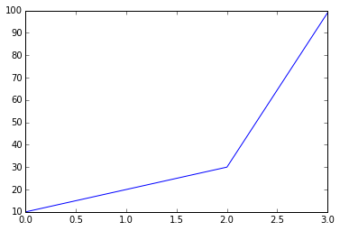
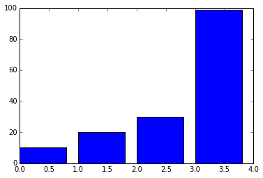
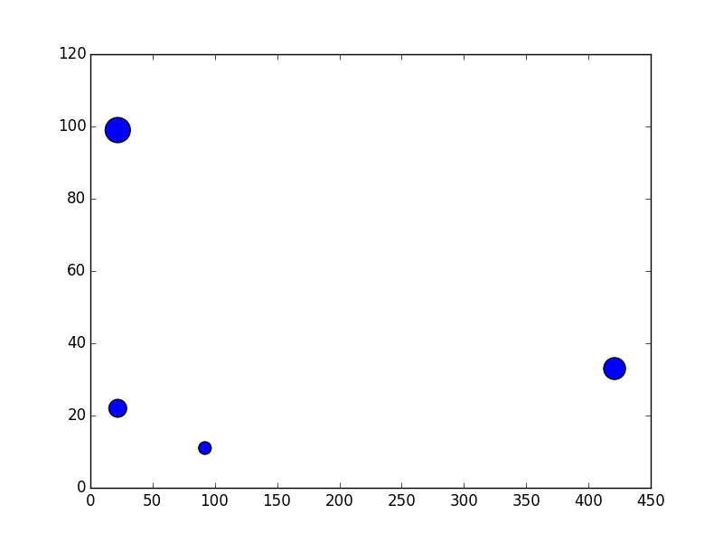
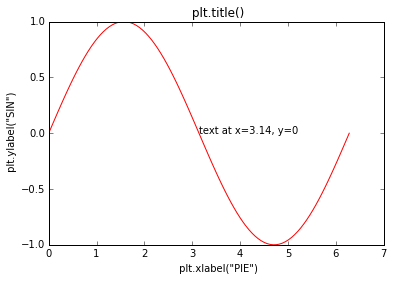
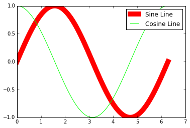
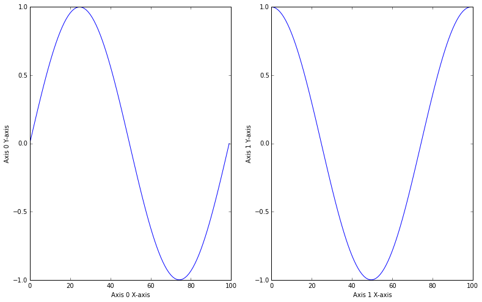
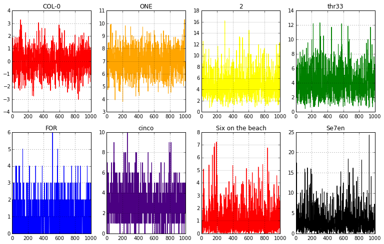
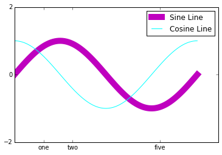
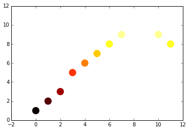
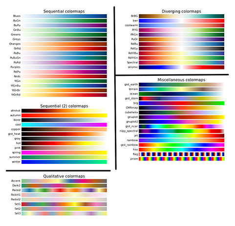

# Introduction to data visualization lecture.  

### Hello Matplotlib.pyplot
As python people, we will be leveraging the plotting library matplotli`b.  It is tricky, but once you get the hang of it, it's as easy as pie.  

Here is a list of the main plots we will be using in the course and how to use them.  
#### Line Plot

```python
import matplotlib.pyplot as plt
ydata = [10,20,30,99]
plt.plot(ydata);
plt.show();
```


---
<br>
#### Bar Plot
```python
plt.bar(left, height, width=0.8, bottom=None, hold=None, **kwargs)

```
```python
# The first argument "left" needs to be a list of the X positions for each bar.  
bars = [10,20,30,99]
xpos = range(len(bars)) #[0,1,2,3]
plt.bar(left=xpos, height=bars)
plt.show()
```

---
<br>
#### Scatter Plot
```python
plt.scatter(x, y, s=20, c='b', marker='o', cmap=None, norm=None, vmin=None, vmax=None, alpha=None, linewidths=None, verts=None, hold=None, **kwargs)
```
```python
x_data = [92, 22, 421, 22]
y_data = [11, 22, 33, 99]
marker_size= [100, 200, 300, 400] #this can be just one value or a list of values the same size of your data
plt.scatter(x=x_data, y=y_data, s=marker_size)
plt.show()
```

---
<br>
#### A line plot with labeled x and y axes

```python
import matplotlib.pyplot as plt
import numpy as np

pie = np.linspace(0, 2 * np.pi, 100)
sine = np.sin(pie)

plt.plot(pie, sine, color='r')
plt.title(' plt.title() ')
plt.xlabel(' plt.xlabel("PIE") ')
plt.ylabel(' plt.ylabel("SIN") ')
plt.text(3.14, 0, 'text at x=3.14, y=0')
plt.show()
```

---

<br>
#### Plotting two data sets on one plot with a legend.
```python
import matplotlib.pyplot as plt
import numpy as np

pie = np.linspace(0, 2 * np.pi, 100)
sine = np.sin(pie)
cosine = np.cos(pie)

plt.plot(pie, sine, color='r', label='Sine Line', linewidth=10);
plt.plot(pie, cosine, color='#00FF00', label='Cosine Line', linewidth=1);
# The legend will reflect the 'label=' text.
plt.legend();
plt.show();
```

---
<br>
#### Dealing with figures and subplots with `plt.subplots()`.

```python
import numpy as np
import matplotlib.pyplot as plt
pie = np.linspace(0, 2 * np.pi, 100)
sine = np.sin(pie)
cosine = np.cos(pie)

# Think of your figure as the canvas, and the ax0, ax1 as their own charts.
fig, (ax0, ax1) = plt.subplots(ncols = 2, figsize=(13,8))
# ax0 is now a subplot object, and have annoying different commands for it.

ax0.set_xlabel('Axis 0 X-axis')
ax0.set_ylabel('Axis 0 Y-axis')
ax0.plot(sine)

ax1.set_xlabel('Axis 1 X-axis')
ax1.set_ylabel('Axis 1 Y-axis')
ax1.plot(cosine);
plt.show();
```

---
<br>
### Lots and lots of subplots.
Subplots are very tricky, so here is another trick on how to create a lot of subplots with a loop.
```python

# First decide on how many plots you would like, and what in layout [ Rows by Cols]
rowz = 2
colz = 4

# Now, use the plt.subplots() and pass in the nrows and ncols arguments.
fig, ax = plt.subplots(nrows= rowz, ncols=colz, figsize=(13,8))


counter = 0
# These are the names of our columns
cols_to_plot = ['COL-0', 'ONE', '2', 'thr33', 'FOR', 'cinco', 'Six on the beach', 'Se7en', 'Ocho-cinco']

# Here is a simple color pallette we will use to color each plot
colorz = ['red', 'orange', 'yellow', 'green', 'blue', 'indigo', 'red', 'black']

for r in range(rowz):
    for c in range(colz):
        # the 'ax' object is a 2d numpy array with values that are subplots.
        # therefore to ax[0,0] is the first subplot in our subplot ax object.
        ax[r,c].plot( df[cols_to_plot[counter]], c=colorz[counter])
        ax[r,c].set_title( cols_to_plot[counter] )
        counter += 1
```

---

<br>
#### Customizing tick labels.
```python
# CUSTOMIZE AXIS TICKS AND SIZE
pie = np.linspace(0, 2 * np.pi, 100)
sine = np.sin(pie)
cosine = np.cos(pie)

plt.plot(pie, sine, color='m', label='Sine Line', linewidth=10);
plt.plot(pie, cosine, color='#00FFFF', label='Cosine Line', linewidth=1);

# Use the plt.yticks with a list of the ticks you would like to render
plt.yticks([-2, 0, 2])

# You can also pass in location, and labels
locations = [1,2,5]
tick_text = ['one', 'two', 'five']
plt.xticks(locations, tick_text)

plt.legend();
plt.show();
```

---

<br>
#### Mapping data to color: colormaps
```python
# COLORING and using color maps
import matplotlib.pyplot as plt
import matplotlib.cm as cm
data = [1,2,3,5,6,7,8,9,10,10,9,8]

# To set the values of your data to a color range,
# Set the 'c' value to be that data you want to map to the color values
# And set the cmap to the colors you would like the data to reflect
plt.scatter(x=range(len(data)), y=data, c=data, cmap=cm.hot, linewidths=0, s=200);
```


---
